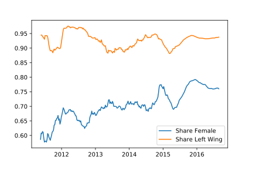
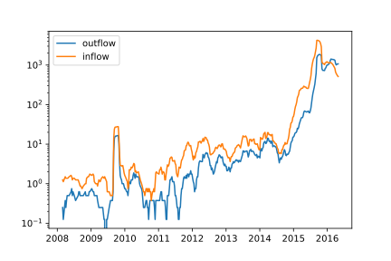

<!DOCTYPE html>
<html>
  <head>
    <title>Title</title>
    <meta charset="utf-8">
    
  </head>
  <body>
    <textarea id="source">

# Narratives agianst critique

## communication patterns within the Danish Refugee Solidarity Movement

---
class: middle
## Overview

1. Background
2. Puzzle
3. Data
4. Methodological Problems and Potentials
5. Narrative/processual methodology
6. Scaling interpretation in Automated text analysis
7. Concluding Remarks

---
class: middle
### Background

1. Political Sociology
2. Micro Sociology and Pragmatism
3. Mixed Method approaches to text data

---
class: middle
- ### Controversy Analysis - mapping and document analysis
- ### Semantic network analysis for detecting conflict and liveliness
- ### Qualitative interpretation and automated text categorization

---

# 

---

## Growth

---

### puzzle "Why the lack of Contention?"

---
Data

1. 119 Refugee Solidarity Facebook Groups
    - 640.000 statements
    - 80.000 users
2. Survey on 2283 activist

3. Over 200.000 Danish Facebook pages (politicians, public figures, news
media, etc) from 2008 – 2018.
  - 75 million posts
  - 4.3 billon likes
  - 700 million comment
  - 70 million tags
  - 3.6 million Danes

---
class: middle
### Qualitative Material
1. Followed loosely the activity of the Groups
2. Read a random sample of 12.000 time ordered posts and comments
3. In depth reading of strategically selected groups

---

class: center, middle
### Activity procentage by political block and gender

???
The movement is highly overrepresented activity from the left side of
the political spectrum. Together with graph over the movements growth
one could read the development as one of a rising distaticefation with
the political parties rhetorics and policies against refugees and
immigrants.

---
class: center, middle
### Membership inflow and outflow over time

---
class: center, middle
### Survivale Function by cohort

---

## Enrich poor activity data with rich textual data

???
Common conception that this should be done with quantitative methods,
but I what to argue that qualitative methods
---
class: middle
### Interpretating Social Media Data

1. Uncertianty about the "where, what, how, who, why"
2. Thin, fragmented, elusive, ephemoral, artificial , cheap

---
class: middle
### A processual methodology for digital data

1. Formation
2. Process/Narrative
3. Situation

???
1) By focusing on the formation of culture, of interaction order, group
norms and practices, instead of assuming them then the thin, fragmented,
elusive, ephemoral  characher of social media data suddenly becomes a
wellcome feature, because is precisly gives us many different ways to
explore when, where, doing what and how with whom things come to gain a
specific definitive form and endure.

2) This entail an investigation of the process or narrative has lead to
and continuely leads to the reoccurance of the phenomenon of interests.
And of course all those things which challenge the stabilization of the
phenomenon of interest. So In the group and even so in many other social
media settings the turnover is very high, where most actor are only
active ones, and groups can grow very quickly. This challenged the style
within the group in various ways. Firstly after a wave of public
attention towards the friendly people initiative many people came into
group. Suddenly a very different from of communication was taking place
and very different stories about refugees and refugee activism, instead
stressing the postive, the hopefull stories, these stories stressed the
hopeless and meaningless situation many refugees find themselves, but
also how this experience of hopeless and meaningless pain and sufferage,
this random distribution of happiness and prusperity created extential
insecurity amoungst the activity - this is a common theme amoungst
humanitarian activism more generally, but modes of storytelling which
had been completely absent before. But this was a rather marginal group
of people not connected to more centeral group members. Another way in
which the group style was challenge was when many people became active
in the group at once all wanting to do something quickly: give shoes,
clothes aso. alot of the effort within the groups was to coordinate
effort then went into channeling these efforts elsewhere. All these
things downplayed what had characterized the group before. And many of
known Faces where not their anymore.

3)  Problem Situation,

1) So many things in my data as generally on social media platforms
happens ones, the platforms ability to captures everthing, makes us as
researchers overwelmed by the amount of information. The focus should be
on stabilization, the event that reoccur

2) A processual methodology focuses on how specific historical event be
consequence through the constant work of the present in making it so,
this is Sewell argument in the Logic of History where the importance of
Bastiale for the frethe French revolution was due to the

---

## Data potentials

1. Cheap, traceble data
2. intersituational variation and variation over time
3. Narrative accounts
4. Close integretion with Quantitative Analysis

---

## Analysis

1. Stabilization of a Friendly group style
2. Undermining the production of contention

---

###  The Formation of a Friendly group style

1. Out of a positive psycology initiative
2. Generalized Friendliness and Positivity
3. No us/them and no negativity

???
In 2013 a Facebook group opens that is suppose to make
Hjoerring muncipality the most happy in the country, user are asked to
train their friendliness muskle, by being friendly, paying attention to
other peoples friendliness and telling other people about thier
experiences with friendliness.

*This wil start a friendliness epidemic.*

The post is written by Marete Bonde Pilgaard a educated Nurse, now
health consultant.

Kære Venligboere Når vi nu alle skal til at træne
"venligheds-musklen"...så skal vi måske bare starte i det små....Alle
ændringer starter med at rette fokus på dét man vil ændre. Læg derfor
mærke til når folk er venlige overfor hinanden eller overfor dig. Begynd
måske endda at kommentere det positivt...både til "den venlige" men også
til folk efterfølgende. Du vil garanteret bemærke at venligheden
smitter! Og så er vi jo igang med venligheds-epidemien! Skriv herinde
hvordan det går:-) Måske har du allerede oplevet noget idag?

The story:
Some quates
narratives that reenact the difference between friendliness and
'negatively'

---
class: middle
### Undermining the production of contention

1. Filter information and activity
2. Encoding habits of action
3. Capturing and Attuning interaction
4. Moral exceptations to the group setting

???
explain with narrative and quates the way in which the friendly style
undermine contentions and critique.

---
class: middle
### Why do we need Qualitative Text Analysis?

1. To uncover actual narratives instead of assuming them
2. To ensure the relevance and validity of ones categories
3. Ensure agianst measurement error

---

---
class: center, middle

### Thank you

### hc@soc.ku.dk

    </textarea>
    
    
  </body>
</html>
